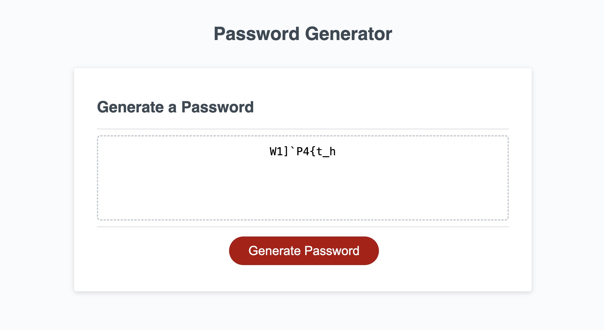
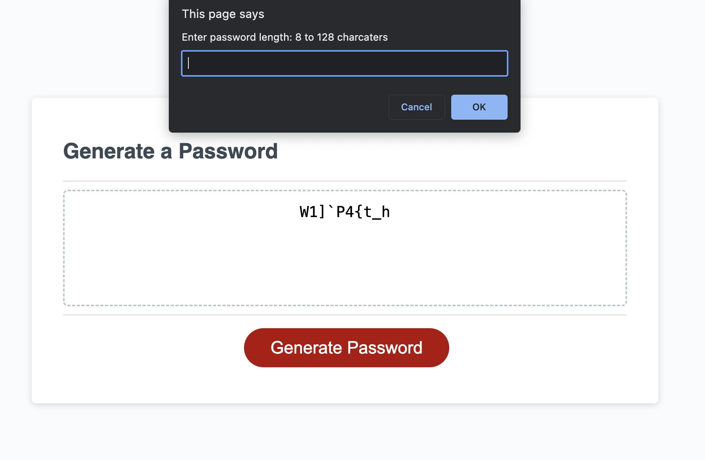

# Password Generator Starter Code
A Password Generator site.

## Description

This site generates a random password based on user input criteria. A user is promted for password length and then asked if they want to include lowercase letters, uppercase letters, numbers, and/or special characters.
The password is then shown on the page.

## Installation

N/A

## Usage

N/A

## Credits

N/A

## License

Please refer to the LICENSE in the repo.